## Regression 

## 0. Introduction

监督性学习可以分为回归和分类两种模型, 分别对应着连续形式和离散形式.

有很多中可以去解释GP(高斯过程)回归模型的方法, 而这里基于函数的观点 - function-view

分节内容如下:

- 2.1 先利用 weight-space 的观点去解释高斯过程, 便于初步理解.
- 2.2 用 function-view 去理解.
- 2.3 高斯过程的行为会随着超参数的变化而变化, 这里讲解参数如何影响高斯过程.以及预测分布相关知识.
- 2.4 讨论如何组合损失函数和预测分布去利用决策理论以最优的方式做出一个点预测. 
- 2.5 一个实际的例子
- 2.6 关于高斯过程的更多的理论分析.
- 2.7 如何整合显式的偏执方程到模型中
- 2.8 历史观点

## 1.  Weight-space View

### 1.0 Introduction

这一节

1. 先是从贝叶斯角度去分析线性模型.
2. 然后使用核技巧去将输入投影到高位空间, 从而对线性模型做出增强.
3. 最后讨论当输入空间非常大以至于多于数据点数时的解决方法.

Notation:

- 输入向量维度是 $D$
- 输入集 : $X$
- 输出集 : $\mathbb{y}$

- 数据集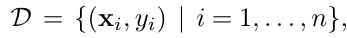 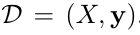

### 1.1  The Standard Linear Model

#### 1.1.1 概率视角的线性模型

从贝叶斯角度来看的线性模型:

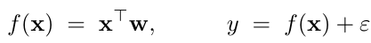

其中误差遵循独立同分布的高斯分布:

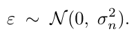

注意, 这里引入的 **随机变量(noise) $\epsilon$ ** , 将观测值 $\mathbb{y}$ 也变成了一个　**在给定参数下的分布的形式**. 

#### 1.1.2 观测值的分布形式

根据观测值来求最大概率.

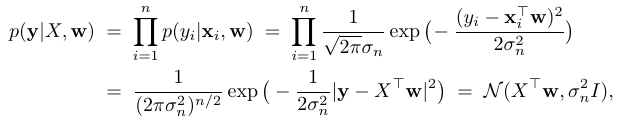

这里就是将1.1.1中提到的加入高斯分布的函数进行了概率化. 

> **函数形式+具体数据(理应为无限)->概率分布形式**

#### 1.1.3 贝叶斯视角的线性模型

##### 1). **贝叶斯公式**

贝叶斯视角即分布中的参数遵循某种分布.

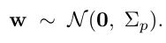

> 这个地方我有个疑问, 为什么 w 的均值会是0? 他很大可能性是不会是零的, 否则, 预测值就该一直是0. 而这里采用0的意义是, 我们对数据一无所知! 因此采取最中立, 还有最小信息的0.

这个就是这个模型中的贝叶斯先验分布.

根据贝叶斯分布的公式, 得到后验概率:

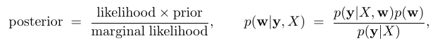

##### 2). **分母是不变的**

其中分母的值是不变的

> 关于这个有两个解释:
>
> - 数据集是已经固定的了,因此是定植
> - 分母是和w无关的, 因为是积分.

##### 3). **展开贝叶斯公式**

对后验公式展开, 并进行转换.

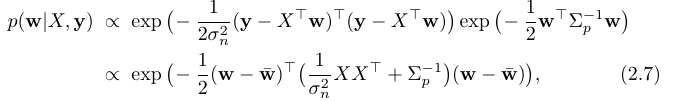

其中, 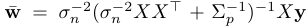

再次进行转换:

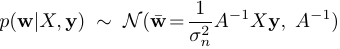

其中, 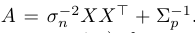

这样我们发现, 在 **假设先验为高斯分布的前提下, 我们得到了一个新的后验高斯分布.**

说明这个模型是共扼分布.

##### 4). **MAP以及岭回归**

MAP的意义是 : maximum a posteriori (MAP), 使用的是对数最大后验法.

- 我们这个时候回顾一般的最小二乘法求解线性模型的方法.

  $w=\underset{w}{\operatorname{argmin}}||y-w^Tx||^2$

- 再看看应用了贝叶斯的最大后验法:

  $w = \underset{w}{\operatorname{argmax}}\ p(w|X,y) =\underset{w}{\operatorname{argmax}}\ \left(-\large(||y-w^Tx||^2/2\sigma_n^2 +\frac{1}{2}w^T\sum_p^{-1}w\large)\right)\\=\underset{w}{\operatorname{argmin}}\ \large(||y-w^Tx||^2/2\sigma_n^2 +\frac{1}{2}w^T\sum_p^{-1}w\large)$

这样的话, 我们就看到, 相比于一般的最小二乘法, 这里只不过是加了一个 **惩罚项**, 但是其在这里的意义却是 **先验概率.**

不同于通过数学分析组织出来的 L2 惩罚项(具体分析见deep learning 笔记第七章). 这里通过贝叶斯方法的先验分布成功地顺其自然地加入了防止过拟合的惩罚项. 

这从一个侧面说明了 : **贝叶斯对与参数符合某一分布的设定, 成功了加入了噪声, 提高了模型的鲁帮性**

##### 5). 预测分布

上面一直说的是对w的分布. 但是我们最终要求的是在给定一个输入下, 输出值的分布. 也就是预测分布.

对于, 输入 $\mathbb{x}_*$, 我们假设其输出为 $f(x_*)=f_*$. 则有:

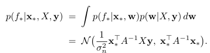

**这个地方实在是太重要了!!!** 这也是为什么要用 **高斯分布做分布假设的原因**, 高斯分布对于很多函数经过转换之后得到的 **预测函数** 依然是 高斯分布.

这里面还有一个非常有意思的点:

预测分布的方差是一个关于输入的二项式函数, 说明, 随着输入的 magnitude 的增加, 预测也就逐渐不准确. 这个时候你可能会问了, 如果数据集本身就是在无零区域的话, 这个岂不是有悖常识, 但是不要忘了, 这里还有个A,  A 在这里应该是可以对这个行为做出解释的. 而我, 并不知道怎么解释.^_^

### 1.2 Projections of Inputs into Feature Space

这里其实在贝叶斯公式推导部分和上面的没有区别, 只是做了一个将低位的输入映射到高维的操作而已, 用的是核方法. 这里不赘述核方法的概念.

下面是公式:

1. 核方法进行高维映射

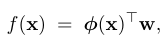

2. 直接得出预测分布:

   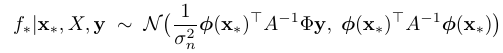

   其中, 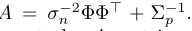

ok, 完.

## 2. Function-space View

### 2.1 Introduction

- **定义**

  高斯过程是一个随机变量的集合, 其中任意数量的随机变量之间都遵循联合高斯分布.

  这里的随机变量应该指的是由输入数据得到的实际值, 即 $f(x)$ , 这里把每个 $f(x_i)$ 到当作一个随机变量. 

  均值函数和协方差函数的形式如下:

  

  模型为 :

  

  具体的求解过程见2.3.

- **有趣之处**

  这就是这个模型有意思的地方 : 将 x 与 y 之间的关系, 转换为了 $f(x)$ 之间的关系. 

  会想到这里, 我们会发现, 到目前为止我们都没有提任何和模型本身性质相关的事, 这里说模型本身的性质是指, 是线性回归, 还是指数回归, 还是其他什么的. 那是不是这个贝叶斯就是这么厉害不用你设定就可以自动发掘出其模式呢? 

  答, 不是的, 我们要**通过设定协方差方程的类型来设定模型的类型**, 具体下面会讲.

  在 weight-view 中, 我们是通过将 w为高斯分布的假设应用到式子中后, 展开式子得出了预测分布. 但是这里不一样, 这里没有尝试去直接推算出预测分布, 而是通过随机变量的均值和方差函数得到最后的值.

- **高斯过程的性质**

  - **consistency requirement**

    **又叫做边缘性质(marginalization property)**

    整体服从多维高斯分布，那么其中一部分也服从对应均值和协方差矩阵的正态分布。

    其实就是说, 若两个变量符合正太分布, 那么其中一个变量也符合正态分布. 公式为:

    $p(x) = \int p(x,y)dy=\int \mathcal{N}(\mu,\sum)dy=\mathcal{N}(\mu_x,\sum_x)$

    这个性质很重要的一点是, 在大的随机变量集的测试结果不会影响小的随机变量集上的性质.

    > 这里的随机变量集是指 : 这里可以理解为训练数据集, 因为高斯过程中的随机变量就是数据集中的数据

  - **满足 consistency requirement的条件**

    条件是, 定义协方差矩阵的函数必须能决定协方差矩阵的所有条目.

    > 这里的条目(entries)是矩阵中的内容的意思, 比如对于 k*k 的协方差矩阵,  (i,j)- th entry of covariance matrix 代表的是变量 i和j 之间的协方差值.

### 2.2 线性模型的均值和方差

还是用刚才的使用核方法的例子来解释. 即, weight-view 是 

其中, $\mathcal{\phi}(x)=(x,x^2,x^3,...)$

那么对于两个具体的数据点 $x,x'$, 我们可以计算其 mean 和 协方差:

- **mean**

  单均值和联合均值:

  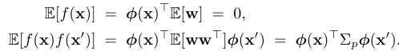

- **variance**

  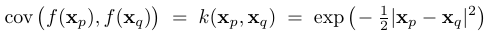

  这里使用的协方差方程是 平方指数函数. 

  性质很容易分析, 两者相近则为1; 反之为0.

  > 这里为什么要用平方指数函数呢? 因为这个在第四章才会将, 不同的模型其实对应着不同的协方差方程. 而线性模型正好对应的就是 平方指数函数, 这里的线性模型的准确英文表达是, Linear-shaped basis function.
  >
  > 而如果模型的函数形状是高斯的话, 其名称为, Gaussian-shaped basis function. 其对应的协方差函数是 **SE 函数**, 形状相当复杂, 有机会看第四章再说这个点.

### 2.3 推导

#### 2.3.1 推导出先验分布

之所以称之为先验分布, 是因为这里的分布是在完全没有数据指导下, 完全依据设计者加入的知识(协方差方程)得到的分布.

###### 1. 采样出n个点

从训练集中得到了采样集 $X_*$, 假设采样了n个点.

###### 2. 得出协方差矩阵

记住每个样本都是一个随机变量, 记下来根据设计的协方差函数, 得到不同随机变量(采样样本)之间的协方差矩阵 $K(X_*,X_*)$, 这个协方差矩阵是 n*n.

###### 3. 根据正态分布得到预测样本点

上面假设的是每一个X都是一个随机变量, 回顾前面的, 我们知道, $f(x)$ 是遵循正态分布的. 也就是:

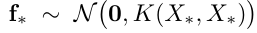

根据这个分布得出预测值. 得出了n个值. 称这n个样本组成的曲线为 **样本曲线**.

下面是图示, 其中蓝色点是采样X对应的真实的Y(由于采样了核方法所以不是线性的), 红色绿色是根据正态分布得到的.

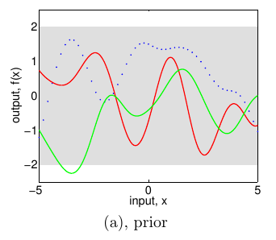

###### 4. 关于这个图

- **为何光滑**

  这个图有个很奇怪的性质就是, 他是很光滑的, 但是他的点是从正态分布中采样出来的, 怎么会如此光滑呢?

  平方指数协方差函数是无穷可微的，也就导致了过程是均方根可微的. (这里的解释我完全不懂, 需要4.1节的知识.)

- **特征长度尺度**

  这里还提到了一个特征长度的问题, 特征长度是指对几何体进行长度度量的一个标准, 不同类型的几何体具有不同的值作为特征长度. 例如球体的特征长度就是直径, 线的特征长度就是线. 而在这个里面的特征长度的评价标准理解为 **在input空间移动多少距离后才会使得输出有一个显著的变化** .

  而这个值是可以进行调整的, 这个例子中, 尺度为1. 而我们可以通过 将 $|x_p-x_q|$ 替换为 $|x_p-x_q|/l$,  $l$ 越大, 得到的样本曲线越平缓.

- **positive pre-factor**

  这个是指 **协方差矩阵的系数**, 在这个例子中, 系数是1. 也就是下面这个:

  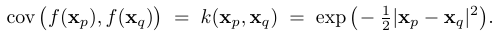

  通过在exp之前加一个正数(应该要小于1, 因为相关系数不能大于1), 可以控制采样出的样本曲线.

#### 2.3.2 推导出后验分布

这里就要结合训练集数据和先验分布进行推导.

###### 1. 得到后验协方差矩阵

这里其实真的就是和上面说的一样, 就是结合起了两者.

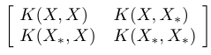

其中, $X$ 是训练集数据中的input, $X_*$ 是测试集数据中的input, 这里通过协方差函数得出了协方差矩阵. 其中, 设训练集中的真实输出是 $f$, 测试集的输出, 也就是我们求的输出为 $f_*$. 

最后的协方差矩阵的大小为 : $(n+n_*)*(n+n_*)$

###### 2. 应用consistency性质

按照前面的2.3的步骤, 这时候理应做的是从2.4.1中制定的协方差矩阵构成的正态分布中采样, 如下图:

这样的话, 我们要求采样出的数据必须使得训练集输入对应的采样输出全为真实输出才可以. 简单粗暴的方法就是采样出成千上亿个, 找到符合要求的, 如果, 我是说如果可以的话, 就可以得到下面这样的图.

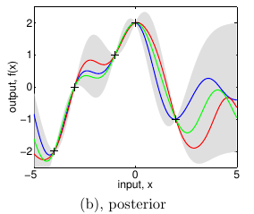

> 注意, 这里和上面的图没有关系, 各种颜色的线并没有对应, 都是随机采样出的结果.
>
> 并且, 阴影部分代表的是采样的95%置信区间.

但是, 很明显这种方法是行不通的. 而我们想要的,是把这个采样转换成一个输出只有 $f_*$ 的形式.

我们可以利用联合高斯分布的consistency性质, 可以转换为下面这个:

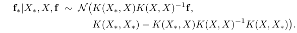

> 具体的转换方法见A.2

### 2.4 Prediction using Noisy Observations

未完...

